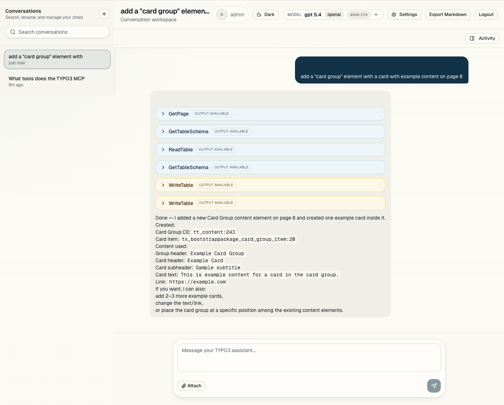
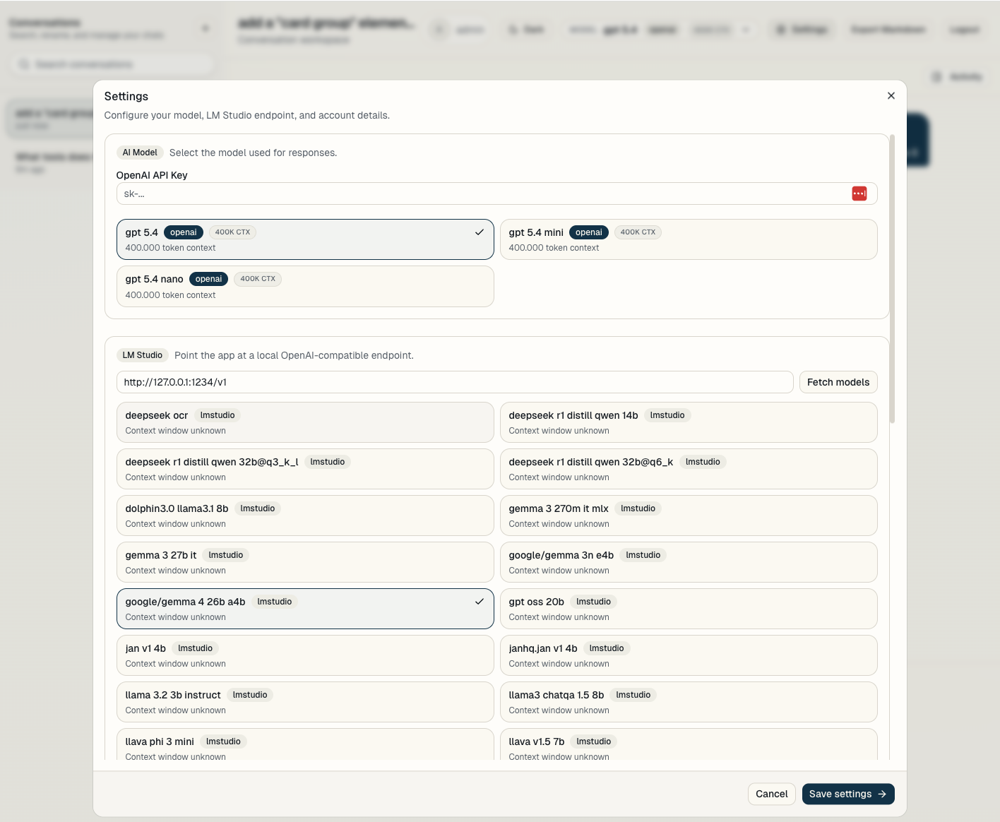

# text-to-typo3

### Prompt your TYPO3 Website's content into existence with AI

`text-to-typo3` is a Next.js App Router application for chatting with a TYPO3 instance through its MCP server (https://github.com/hauptsacheNet/typo3-mcp-server). Editors authenticate with TYPO3 OAuth or local MCP token mode, work inside conversation threads, inspect tool calls inline, approve TYPO3 writes when needed, and use OpenAI, LM Studio, or custom OpenAI-compatible model providers from the same interface.

The project is released under the MIT license.

## What The App Does

- Authenticates against TYPO3 with OAuth 2.0 Authorization Code + PKCE.
- Stores encrypted TYPO3 session tokens in SQLite and restores sessions across refreshes.
- Streams AI responses token-by-token with the Vercel AI SDK.
- Persists conversations, messages, tool calls, and per-user model settings in SQLite.
- Connects server-side to the TYPO3 MCP endpoint and forwards the authenticated TYPO3 bearer token on every MCP request.
- Applies a consistent API auth wrapper and JSON error shape across app API routes.
- Supports multi-step MCP tool execution so the assistant can inspect TYPO3 state, fetch schema details, and continue to follow-up tool calls inside the same response.
- Protects MCP requests with request timeouts, expiring session cache entries, and tool-cache invalidation when Write Approval mode changes.
- Guides TYPO3 write operations toward schema-aware retries when a `WriteTable` call returns validation or missing-input feedback.
- Supports TYPO3 tool calling for OpenAI, LM Studio, and custom OpenAI-compatible providers through the same server-side MCP bridge, with provider-specific model routing where needed.
- Surfaces pending Write Approval through a persistent banner above the composer and a highlighted tool card in the transcript.
- Renders MCP tool calls inline in the chat and in a filterable Activity sidebar.
- Supports message editing and rerunning from an earlier user prompt.
- Supports image attachments through drag-and-drop or the file picker.
- Supports cached, debounced conversation search, inline rename, delete, and Markdown export.
- Supports provider-aware model selection from OpenAI, LM Studio, and custom endpoints, including context-window hints in the UI.
- Queries model providers in parallel with per-provider timeouts, provider status, and persisted context-window hints for chat budgeting.
- Includes a scaffold CLI for provisioning a local TYPO3 + DDEV environment and writing matching app configuration.

## Screenshots

| Chat Interface | Settings Modal |
|:--:|:--:|
|  |  |

## Tech Stack

- Next.js 16 App Router
- React 19
- Vercel AI SDK
- `@ai-sdk/openai`
- SQLite via `better-sqlite3`
- Drizzle ORM
- Tailwind CSS
- shadcn/ui and Base UI primitives
- Iron Session

## Requirements

### App runtime

- Node.js 20+
- pnpm

### TYPO3 scaffold workflow

- `ddev`
- `composer`
- `php`

## Environment Variables

Copy `.env.example` to `.env.local` in the project root and fill in your own values.

```bash
TYPO3_BASE_URL=https://your-typo3.example
TYPO3_MCP_URL=
TYPO3_MCP_ACCESS_TOKEN=
TYPO3_LOCAL_USER_NAME=Local TYPO3 Token
TYPO3_OAUTH_CLIENT_ID=your-client-id
TYPO3_OAUTH_CLIENT_SECRET=your-client-secret
OPENAI_API_KEY=your-openai-api-key
ENCRYPTION_KEY=generate-a-64-char-hex-key
SESSION_SECRET=generate-a-long-random-secret
NEXT_PUBLIC_APP_URL=http://localhost:3000
TYPO3_MCP_SYSTEM_PROMPT=Optional TYPO3-specific system prompt text
TYPO3_AGENT_MAX_STEPS=12
MODEL_CATALOG_TIMEOUT_MS=4000
DATABASE_PATH=data/app.db
```

### Notes

- `TYPO3_BASE_URL` is always required.
- `TYPO3_OAUTH_CLIENT_ID` and `TYPO3_OAUTH_CLIENT_SECRET` are required in OAuth mode.
- `TYPO3_MCP_URL` can point directly at the MCP endpoint, including the tokenized URL from the TYPO3 MCP Server backend screen.
- `TYPO3_MCP_ACCESS_TOKEN` enables token-based local mode when the TYPO3 instance expects a bearer token instead of browser OAuth.
- `TYPO3_LOCAL_USER_NAME` controls the synthetic local display name used in token-based mode.
- `OPENAI_API_KEY` enables the default OpenAI model catalog and acts as the fallback server-side key when a user has not stored a personal OpenAI key in Settings.
- `ENCRYPTION_KEY` is used for secrets stored in SQLite.
- `SESSION_SECRET` secures the Iron Session cookie.
- `NEXT_PUBLIC_APP_URL` should match the externally reachable app URL used in the TYPO3 OAuth callback.
- `TYPO3_MCP_SYSTEM_PROMPT` is appended to the chat system prompt for instance-specific guidance.
- `TYPO3_AGENT_MAX_STEPS` controls the maximum model/tool round-trips in one chat request. The default is `12`.
- `MODEL_CATALOG_TIMEOUT_MS` controls the per-provider model catalog timeout. The default is `4000`.
- `DATABASE_PATH` points at the SQLite database file. The default is `data/app.db`.
- Never commit `.env.local`, scaffold output, or generated TYPO3 credentials.

Detailed TYPO3 setup, Composer packages, and OAuth value mapping are documented in [docs/typo3-setup.md](./docs/typo3-setup.md).

## Installation

```bash
pnpm install
```

Create your local environment file:

```bash
cp .env.example .env.local
```

## TYPO3 Instance Setup

The TYPO3 instance needs the MCP server extension and TYPO3 OAuth endpoints that match this app's auth flow.

Two TYPO3 connection modes are supported:

- OAuth mode for full TYPO3 browser login
- token-based local mode using the MCP token URL shown in the TYPO3 backend MCP Server screen

### Required Composer packages in TYPO3

```bash
composer require hn/typo3-mcp-server
```

`hn/typo3-mcp-server` requires TYPO3 13.4+ and pulls in `typo3/cms-workspaces` as a dependency.

### Optional TYPO3 packages

```bash
composer require georgringer/news
```

`georgringer/news` is only needed if the TYPO3 instance should expose news records for MCP workflows or scaffolded demo content.

### Exact `.env.local` value mapping

- `TYPO3_BASE_URL`: the TYPO3 site origin, for example `https://my-project.ddev.site`
- `TYPO3_MCP_URL`: optional full MCP endpoint URL, including `?token=...` when using token mode
- `TYPO3_MCP_ACCESS_TOKEN`: optional raw MCP token when the TYPO3 instance accepts bearer-token MCP requests
- `TYPO3_OAUTH_CLIENT_ID`: the OAuth client ID registered in TYPO3 for this app
- `TYPO3_OAUTH_CLIENT_SECRET`: the matching OAuth client secret from TYPO3
- `NEXT_PUBLIC_APP_URL`: the externally reachable URL of this Next.js app, for example `http://localhost:3000`

The app uses these TYPO3 endpoints:

- `${TYPO3_BASE_URL}/oauth/authorize`
- `${TYPO3_BASE_URL}/oauth/token`
- `${TYPO3_BASE_URL}/oauth/userinfo`
- `${TYPO3_BASE_URL}/oauth/revoke`
- `${TYPO3_MCP_URL}` or `${TYPO3_BASE_URL}/mcp`

The step-by-step process for getting those values is documented in [docs/typo3-setup.md](./docs/typo3-setup.md).

## Running The App

### Development

```bash
pnpm dev
```

Open [http://localhost:3000](http://localhost:3000).

In OAuth mode, unauthenticated requests redirect to `/api/auth/login`, which starts the TYPO3 OAuth flow. In token-based MCP mode, the app redirects directly into the chat UI without the browser OAuth round-trip.

Next.js development requests under `/_next/*` bypass the auth proxy so Fast Refresh and other dev-runtime internals can connect directly to the dev server.

### Production build

```bash
pnpm build
pnpm start
```

## Available Scripts

```bash
pnpm dev
pnpm dev:turbopack
pnpm build
pnpm start
pnpm typecheck
pnpm test
pnpm lint
pnpm scaffold
pnpm db:generate
pnpm db:migrate
pnpm db:studio
```

### Script reference

- `pnpm dev`: starts the Next.js development server.
- `pnpm dev:turbopack`: starts the Next.js development server with Turbopack.
- `pnpm build`: creates the production build.
- `pnpm start`: serves the production build.
- `pnpm typecheck`: runs TypeScript without emitting build artifacts.
- `pnpm test`: runs the Vitest suite.
- `pnpm lint`: runs ESLint.
- `pnpm scaffold`: provisions or refreshes a local TYPO3 scaffold plan.
- `pnpm db:generate`: generates Drizzle SQL from schema changes.
- `pnpm db:migrate`: runs Drizzle migrations.
- `pnpm db:studio`: opens Drizzle Studio for local database inspection.

## Core User Flows

### Authentication

- Visiting the app without a valid session starts TYPO3 OAuth login in OAuth mode and opens the chat directly in token-based MCP mode.
- The callback exchanges the authorization code, stores encrypted tokens in SQLite, and writes the Iron Session cookie.
- Expired access tokens are refreshed transparently.
- Logout revokes TYPO3 tokens when possible and clears the local session.

### Conversations

- The home route redirects to the latest conversation or creates a default one for first-time users.
- Conversations are listed in a left sidebar, ordered by last activity.
- Conversations can be created, renamed inline, deleted, searched with a debounced cached query, and exported as Markdown.
- Sidebar results stay visible while background refreshes run, and same-key requests share in-flight fetches.
- The first user prompt in a new conversation becomes the basis of the auto-generated title.

### Chat

- Messages stream in real time.
- Assistant responses render Markdown with GFM tables and code blocks.
- User messages support copy, timestamp hover state, edit-and-rerun, and image attachments.
- Stopping generation preserves the partial response.
- Conversation history restores after reload.
- TYPO3 MCP sessions can span several tool steps inside one response, up to `TYPO3_AGENT_MAX_STEPS` model/tool round-trips per request.
- Chat requests resolve the turn, provider, and persistence plan through dedicated modules before streaming.
- Long tool outputs are condensed or older turns are dropped for model input when the active context window requires budgeting; persisted messages stay unchanged.
- When TYPO3 write validation fails, the assistant is instructed to inspect schema details and retry with corrected `WriteTable` input before treating the task as blocked.

### Tool calls

- MCP tools are fetched server-side and cached per session.
- MCP calls use request-level timeouts and categorized errors for hung or unreachable TYPO3 MCP servers.
- The app initializes and reuses TYPO3 MCP session IDs when the TYPO3 server supports MCP session headers, and session cache entries expire automatically.
- Tool caches are keyed by Conversation Write Approval mode so auto-approve toggles use the correct tool definitions.
- Read and write tool calls are rendered as collapsible cards in the chat thread.
- The Activity sidebar shows the same tool traffic in chronological order with read/write filters.
- Write results can expose a direct TYPO3 backend record link when the MCP response includes record metadata.
- Write operations pause for approval unless the Conversation has auto-approve writes enabled. Pending approvals show Approve/Deny controls in the banner and in the relevant tool card.
- The upstream TYPO3 MCP server toolset used by the app includes `GetPageTree`, `GetPage`, `ListTables`, `ReadTable`, `Search`, `GetTableSchema`, `GetFlexFormSchema`, and `WriteTable`.

### Model selection

- The header shows the selected model for the active conversation.
- The settings modal includes OpenAI, LM Studio, and custom OpenAI-compatible provider configuration.
- Per-user settings, configured providers, selected model IDs, and context-window hints are persisted in SQLite.
- Model providers are queried in parallel with per-provider status. Slow or unreachable providers appear as unavailable while other provider results stay usable.
- Settings render saved values immediately while provider catalogs load in the background.
- Context-window information is shown in model cards and persisted for chat budgeting.
- The default selected model falls back to `gpt-5.4-mini` when no user preference is stored.
- `gpt-5.4-nano` uses the provider's built-in MCP server tool integration; other OpenAI-compatible models use the app's TYPO3 MCP bridge.
- LM Studio and custom OpenAI-compatible models use the chat-completions path and the same server-side TYPO3 MCP bridge as the app-managed OpenAI path.
- For TYPO3 mutation requests on OpenAI-compatible chat-completions models, the chat loop keeps tool calling active until a write succeeds or the configured step cap is reached.

## UI Overview

### Header

- Active conversation title
- Current TYPO3 user identity
- Selected model indicator
- Theme toggle
- Settings modal
- Markdown export action
- Logout action

### Left sidebar

- Conversation list
- Search field
- New conversation button
- Inline rename and delete controls
- Mobile sheet presentation on narrow screens

### Main chat area

- Streaming message list
- Inline MCP tool cards
- Pending Write Approval banner
- Composer with message editing state
- Drag-and-drop image attachments
- Stop button during generation

### Right sidebar

- Activity timeline for MCP tool calls
- Read/write filters

## Data Storage

The app stores its local database in `data/app.db`.

The current schema includes:

- `users`
- `sessions`
- `conversations`
- `messages`
- `user_settings`

The schema includes indexes for conversation/message/session lookup paths and SQL aggregates for assistant token totals. Existing development databases are repaired on app startup when an expected non-production column is missing.

## TYPO3 Scaffold CLI

The scaffold command prepares a TYPO3-oriented local environment and matching app configuration.

### Basic usage

```bash
pnpm scaffold
```

### Options

```bash
pnpm scaffold --dry-run
pnpm scaffold --force
pnpm scaffold --instance-dir typo3-instance
pnpm scaffold -i typo3-instance
pnpm scaffold --php-version 8.3
pnpm scaffold --project-name my-typo3-demo
pnpm scaffold --help
```

### Behavior

- Checks that `ddev`, `composer`, and `php` are available.
- Configures a TYPO3 DDEV project.
- Installs TYPO3 base distribution and `hn/typo3-mcp-server`.
- Creates generated credentials and writes `.env.local`.
- Persists scaffold state under `typo3-instance/.codex-scaffold/`.
- Writes a human-readable scaffold summary with follow-up guidance.
- Re-running the command on an already scaffolded project exits cleanly.
- `--force` refreshes generated artifacts and rewrites scaffold-managed files.

### Help output

```bash
pnpm scaffold --help
```

The CLI supports these automation hooks:

- `TYPO3_SCAFFOLD_WORKSPACE_COMMAND`
- `TYPO3_SCAFFOLD_DEMO_CONTENT_COMMAND`
- `TYPO3_SCAFFOLD_NEWS_COMMAND`
- `TYPO3_SCAFFOLD_OAUTH_CLIENT_COMMAND`

The scaffold flow also exports these hook context variables while those commands run:

- `TYPO3_SCAFFOLD_PROJECT_NAME`
- `TYPO3_SCAFFOLD_INSTANCE_DIR`
- `TYPO3_SCAFFOLD_BACKEND_URL`
- `TYPO3_SCAFFOLD_SITE_NAME`
- `TYPO3_SCAFFOLD_WORKSPACE_NAME`

Each hook is a shell command that runs inside the scaffold flow, which makes it possible to automate TYPO3-specific workspace creation, demo content seeding, news seeding, and OAuth client registration without hardcoding project-specific TYPO3 commands in the repository.

## LM Studio Configuration

LM Studio uses its OpenAI-compatible endpoint.

Typical setup:

1. Start LM Studio locally.
2. Copy the API base URL, usually `http://localhost:1234/v1`.
3. Open Settings in the app.
4. Paste the base URL into the LM Studio section.
5. Click `Fetch models`.
6. Select a model in Settings.

The model catalog endpoint accepts an LM Studio base URL override, which is how the Settings UI fetches available local models before saving a selection.

## OpenAI Configuration

OpenAI models are available when either:

- `OPENAI_API_KEY` is set server-side, or
- a user stores a personal OpenAI API key in Settings.

The user-specific key takes precedence for that user.

## Custom OpenAI-Compatible Providers

Settings can store additional OpenAI-compatible providers. Each custom provider has:

- display name
- base URL
- optional API key

Custom provider API keys are encrypted in SQLite. Custom provider model IDs use the `custom:<provider-id>:<remote-model-id>` format internally, while Settings shows the provider display name and remote model name.

## File Attachments

The composer accepts image attachments through:

- drag-and-drop onto the composer
- the attachment button in the composer

Attached images are sent as AI SDK file parts and are persisted with the message history.

## Export Format

Conversation export is available from the conversation header. The generated Markdown file includes:

- conversation metadata
- the full ordered message transcript
- serialized tool-call data for messages that include tool output
- assistant messages that contain tool-only steps, even when the natural-language response is empty

## Manual Test Plan

A short manual test plan lives in [docs/testing.md](./docs/testing.md).

## Security Notes

- Secrets belong in `.env.local` or your deployment platform's secret storage, not in Git.
- `pnpm scaffold` generates local credentials and a scaffold summary; both stay ignored by default.
- In production, `SESSION_SECRET` must be set explicitly.

## License

MIT. See [LICENSE](./LICENSE).

## Project Structure

```text
src/
  app/
    api/
    conversations/
  components/
    chat/
    conversations/
    settings/
    ui/
  lib/
scripts/
docs/
drizzle/
```

## Current Development Notes

- The app assumes one TYPO3 instance per deployment, configured by environment variables.
- LM Studio and custom provider support are wired through the same settings and chat flow as OpenAI-compatible providers.
- The scaffold command supports hook-based TYPO3 automation for workspace, demo content, news, and OAuth registration tasks.
